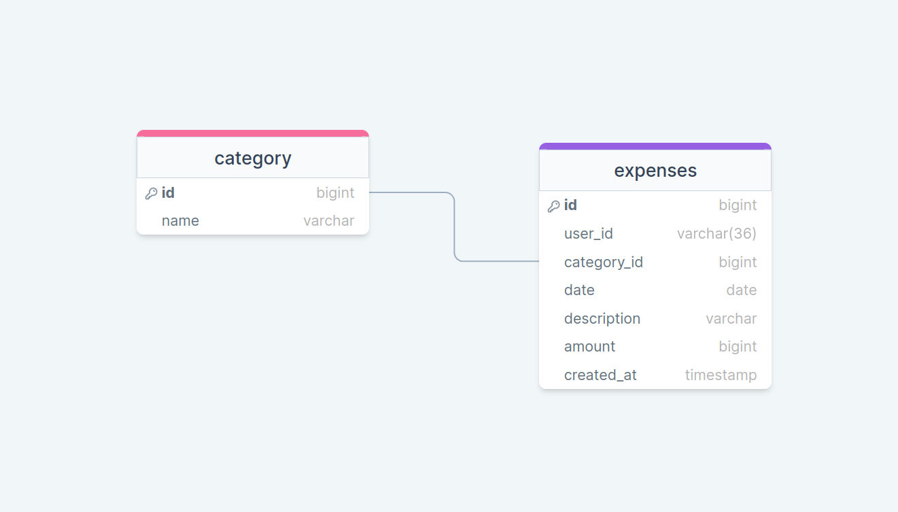

# Тестовое задание на позицию Middle Go developer в компанию HumoLab 

## Задание
Простой API для трекинга расходов пользователей системы с использованием базы данных
База данных:
- Разработайте схему таблиц базы данных.
- Используйте PostgreSQL для хранения данных о расходах пользователей. 

Эндпоинт для ввода расходов:
Реализуйте POST-запрос для ввода расходов пользователей системы. Запрос должен включать информацию о пользователе (например, идентификатор пользователя), сумме, категории и дате расхода. Сохраните информацию о расходе в базе данных.

Эндпоинт для статистики по категориям (Добавить фильтры по категории, по сумме и дате):
Создайте GET-запрос для получения статистики расходов по категориям для всех пользователей из базы данных.

Эндпоинт для статистики по категориям конкретного пользователя (Добавить фильтры по категории, по сумме и дате):
Создайте GET-запрос для получения статистики расходов по категориям для одного конкретного пользователя.

Обработка ошибок:
Обработайте возможные ошибки, такие как некорректные запросы, проблемы с базой данных.

Логирование:
Добавьте базовое логирование для отслеживания запросов и возможных ошибок, с уровнями логов.

Тестирование:
Напишите базовые тесты, проверяющие функциональность эндпоинтов, обработку ошибок.
Дополнительные фичи (по желанию):


## Stack
Golang, PostgreSQL, Nginx

## Cхема базы


## Запуск проекта
1. Склонировать репозиторий
```
git clone 
```

2. Перейти в папку проекта
```
cd expense-tracker
```

3. Запустить проект
```
docker compose up -d
```

4. Сервер будет слушать 80 порт

# Endpoints
## Ввод расхода пользователя
### URL: POST - /api/v1/tracker
#### Параметры запроса
|Имя        |Тип                            |Описание                     |
|----------------|-------------------------------|-----------------------------|
|user_id      |UUID                    |Уникальный идентификатор пользователя|
|category|string|Название категории|
|amount|float|Сумма расхода (0.00)|
|date|time|Дата расхода (dd-mm-yyyy)|
|description|string| Описание расхода (опционально)|

#### Пример запроса
```
curl POST 'http://localhost:80/api/v1/tracker' \
--data '{
    "user_id": "040d5fcb-2878-42e8-8205-29add0367a12",
    "category": "food",
    "amount": 100.00,
    "date": "23-02-2024",
    "description": "lunch"
}'
```

## Добавление новой категории
### URL: POST - /api/v1/tracker/categories
#### Параметры запроса
|Имя        |Тип                            |Описание                     |
|----------------|-------------------------------|-----------------------------|
|category|string|Название категории|

#### Пример запроса
```
curl POST 'http://localhost:80/api/v1/tracker/categories' \
--data '{
    "category": "work"
}'
```
## Статистика всех пользователей по категориям
### URL: GET - /api/v1/tracker/stats/categories
#### Параметры фильтрации
|Имя        |Тип                            |Описание                     |
|----------------|-------------------------------|-----------------------------|
|category|string|Название категории|
|min_amount|float|Минимальная сумма (0.00)|
|max_amount|float|Максимальная сумма (0.00)|
|start_date|time|Дата начала (dd-mm-yyyy)|
|end_date|time|Дата конеца (dd-mm-yyyy)|

#### Пример запроса
```
curl POST 'http://localhost:80/api/v1/tracker/stats/categories?category=home&min_amount=50&max_amount=90&start_date=01-01-2024&end_date=15-02-2024'
```

#### Параметры ответа
|Имя        |Тип                            |Описание                     |
|----------------|-------------------------------|-----------------------------|
|error*      |string                    |Возвращается при возникноваении ошибки|
|result|object|Содержит массив расходов по категориям|
|category|string|Название категории|
|total_expenses|float|Общая сумма расходов в текущей категории|
|expenses_count|int|Общее количество расходов в текущей категории|
|users_expenses|object|Содержит расходы пользователей|
|user_id|UUID|Уникальный идентификатор пользователя|
|total|float|Сумма расходов пользователя|
|count|int|Количество расходов пользователя|

#### Пример ответа в случае успеха
В случае успешного ответа, клиент получает статус код 200.
```json
{
    "result": [
        {
            "category": "home",
            "total_expenses": 87.01,
            "expenses_count": 1,
            "users_expenses": [
                {
                    "user_id": "d3aaa3f0-b9aa-4011-9549-c6d7c406c336",
                    "total": 87.01,
                    "count": 1
                }
            ]
        }
    ]
}
```
#### Пример ответа в случае ошибки
```json
{
    "error": "category not exists"
}
```

## Статистика пользователя
### URL: GET - /api/v1/tracker/stats/users/{id}
#### Параметры запроса
|Имя        |Тип                            |Описание                     |
|----------------|-------------------------------|-----------------------------|
|id|UUID|Уникальный идентификатор пользователя (добавлять в URL)|
#### Параметры фильтрации
|Имя        |Тип                            |Описание                     |
|----------------|-------------------------------|-----------------------------|
|category|string|Название категории|
|min_amount|float|Минимальная сумма (0.00)|
|max_amount|float|Максимальная сумма (0.00)|
|start_date|time|Дата начала (dd-mm-yyyy)|
|end_date|time|Дата конеца (dd-mm-yyyy)|

#### Пример запроса
```
curl POST 'http://localhost:80/api/v1/tracker/stats/users/040d5fcb-2878-42e8-8205-29add0367a12?category=sweets&min_amount=500&max_amount=900&start_date=01-01-2024&end_date=29-02-2024'
```


#### Параметры ответа
|Имя        |Тип                            |Описание                     |
|----------------|-------------------------------|-----------------------------|
|error*      |string                    |Возвращается при возникноваении ошибки|
|result|object|Содержит массив расходов по категориям|
|category|string|Название категории|
|total_expenses|float|Общая сумма расходов в текущей категории|
|expenses_count|int|Общее количество расходов в текущей категории|
|expenses|object|Содержит подробные расходы пользователя|
|amount|float|Сумма расхода|
|description|string|Описание расхода|
|date|time|Дата расхода (dd-mm-yyyy)|

#### Пример ответа в случае успеха
В случае успешного ответа, клиент получает статус код 200.
```json
{
    "result": [
        {
            "category": "drink",
            "total_expenses": 684.07,
            "expenses_count": 1,
            "expenses": [
                {
                    "amount": 684.07,
                    "description": "Generic",
                    "date": "24-02-2024"
                }
            ]
        }
}
```

#### Пример ответа в случае ошибки
```json
{
    "error": "invalid date format"
}
```